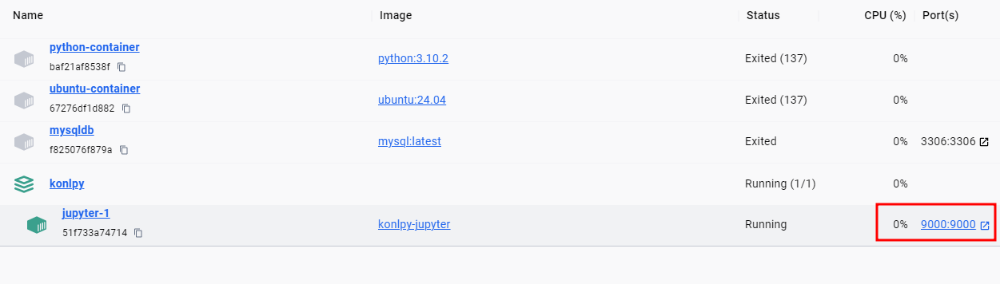
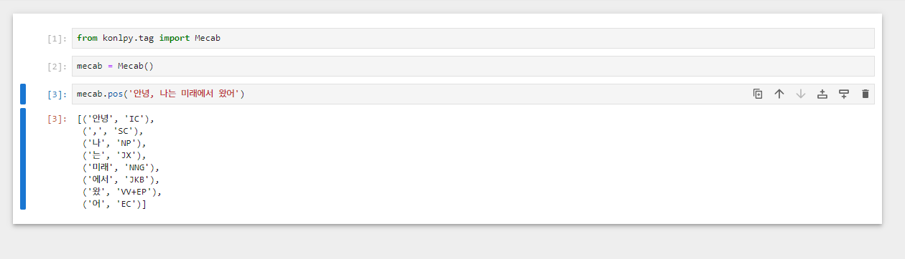

# KoNLPy with Mecab Docker Image 
[mecab-ko](https://eunjeon.blogspot.com/)가 설치된 [KoNLPy](https://konlpy.org/en/latest/)의 `Dockerfile` 및 `docker-compose.yml` 입니다.

또한 Mecab을 활용할 수 있도록 `Jupyter Notebook` 또한 같이 빌드할 수 있도록 설정하였으므로 활용하시면서 텍스트 분석을 조금 더 용이하게 사용하시면 좋겠습니다. 

# STEP.1 
- 사용방법 
1. 이미지 생성 
하기와 같이 클론하여 빌드합니다. 
```bash
$ git clone https://github.com/UICHEOL-HWANG/KoNLPy_container.git

$ cd KONLPY
$ docker-compose build 
........ 

$ docker-compose up -d
```

# STEP.2 
이미 requirements.txt안에 필요한 패키지들은 설치되어 있으므로 Docker Desktop 안에서 실행해주면 된다. 

# 추가사항 
* 이미 로컬 설치된 주피터 노트북의 port는 8888로 로컬 주피터와의 충돌을 피하기 위해 포트를 9000번으로 우회했으니 참고바람 

# 구현화면 


* 저 port를 클릭하면 접속할 수 있다 

* 토큰 패싱을 했으니 보안상 문제가 있을 수 있으니까 그 부분 유의하시길 


성공